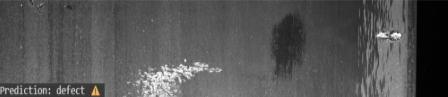
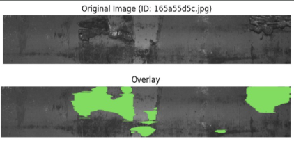

# Automating-Quality-Inspection-for-Fabricated-Steel-Parts
Overview: This project focuses on automated defect detection and localization in steel sheets using Deep Learning.
It combines classification (MobileNetV2) to quickly flag defective sheets and segmentation (U-Net) to precisely highlight defect regions.

## Problem Statement
- Steel industries need accurate and fast defect detection to ensure product quality. Manual inspection is:
- - Time-consuming
  - Inconsistent (depends on human accuracy)
  - Expensive for large-scale production

## Approach
1. Classification – ResNet50
   - Model Choice: Tested multiple CNNs; ResNet50 gave best speed vs accuracy balance.
   - Why ResNet50: Fast, accurate → ideal for real-time inspection.
   * Pipeline:
     - Input image → ResNet50 backbone
     - Customized classification head → Dense layers + Dropout
     - Output → Defect / No Defect label
    * Example Output:
      

2. Segmentation – U-Net
   - Used U-Net encoder–decoder to locate exact defect regions.
   - Produces pixel-wise masks showing defect boundaries.
   - Outperformed other segmentation methods with cleanest boundaries.
   * Pipeline:
     - Input image → Encoder (extracts features)
     - Decoder reconstructs spatial info → segmentation mask
     - Overlay mask on original image for visualization
     
     * Example Output:
       - Original Image → Steel surface with rust/wear
       - Segmentation Mask → Green highlighted defective regions
         

## Results
- Classification (ResNet50):
  - Accuracy: ~90%
  - Fast inference on GPU + edge devices
- Segmentation (U-Net):
  - Precise defect boundaries
  - Enabled automation of inspection

## Dataset
- Source: Severstal Steel Defect Dataset (Kaggle)
- Includes steel surface images with annotations (masks) for 4 defect classes.

## Tech Stack
- Python
- TensorFlow / Keras
- OpenCV
- NumPy / Pandas
- Matplotlib (visualization)

## Applications
- Automated quality inspection in steel plants

Early defect detection → reduces wastage

Integration with production line cameras for real-time defect monitoring
